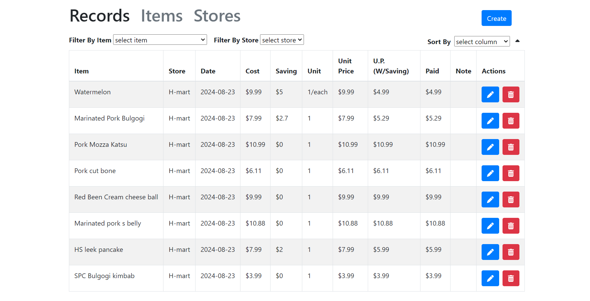

# Receipt Recorder Frontend

This application allowed users to record the merchandise they bought from grocery stores. It can be used to compare the prices between the stores or to see the frequency of purchasing specific items.

This is the front end of the [Receipt Recorder](https://github.com/allenLQVE/ReceiptRecorder). This project uses React with Boostrap. It connects to the back end with API calls with the Axios package. 

### Guide
This project runs with React 18.3.1 on Node.js 10.7.0. Please install Node.js to run the application. \
As this is the front end of the [Receipt Recorder](https://github.com/allenLQVE/ReceiptRecorder). It requires the server to run.

After the tables are loaded successfully, the records, items, and stores can be added through the pop-up windows. All the data can be edited through the action button which opens a pop-up window for edit.

### Warning
This project is not ready to be deployed. Please be aware that security needs to be taken care of before deployment.
